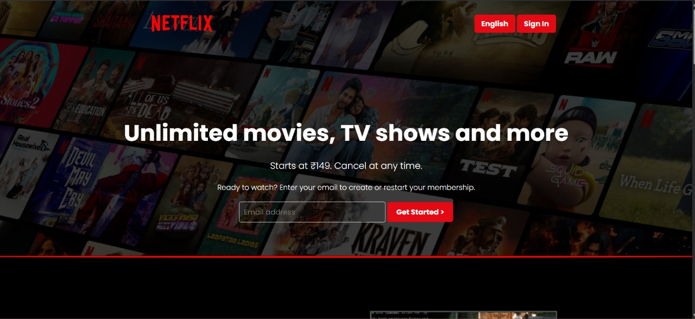
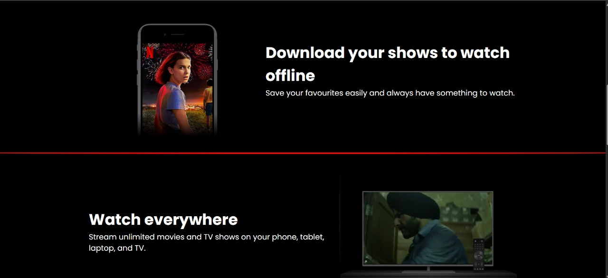
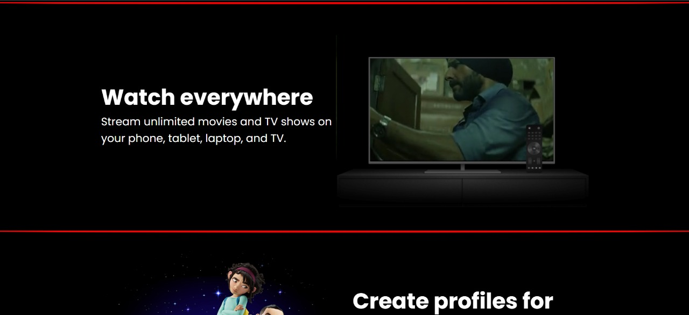
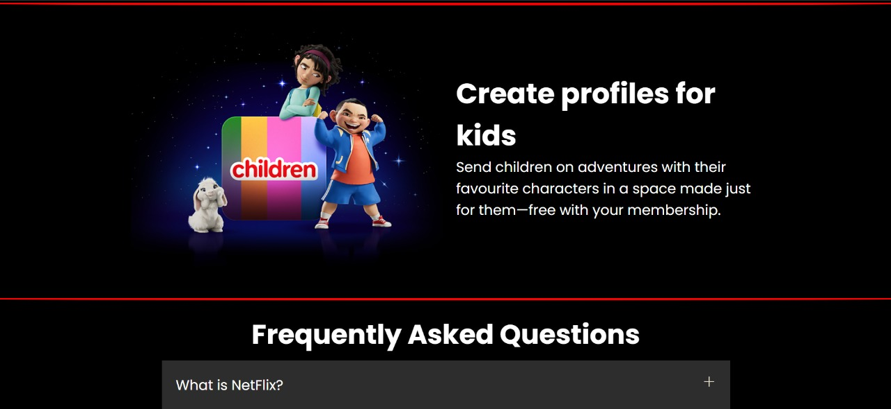
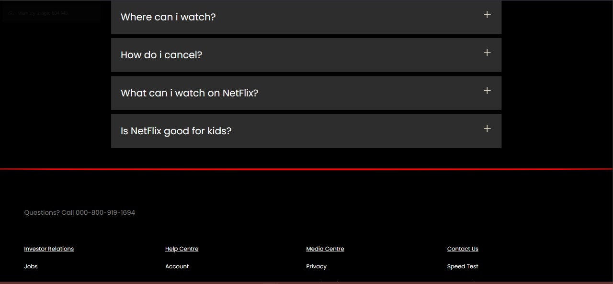
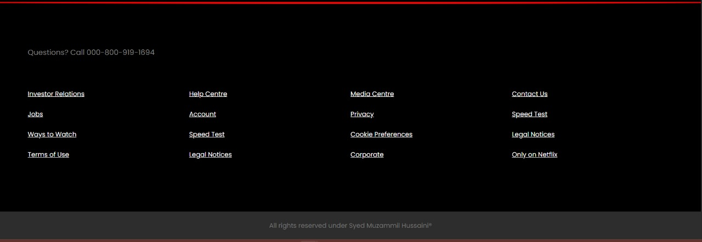

# 🎬 Netflix Landing Page - HTML & CSS Frontend

Welcome to my Netflix Landing Page project! This is a simple, responsive frontend clone of the Netflix landing page, built purely using **HTML** and **CSS**.

> ⚠️ This is a static frontend project with no backend or JavaScript functionality.

---

## 📸 Preview

  
  

  
  
  
*Add a screenshot of your UI here*

---

## 🚀 Features

- 💻 Fully Responsive Design
- 🎨 Stylish Netflix-themed UI
- 🧼 Clean and Structured Code
- 📱 Mobile-friendly layout
- 📷 Hero banner with background overlay

---

## 📁 Project Structure

```bash
netflix-clone/
│
├── index.html         # Main HTML file
├── style.css          # Styling file
      
  
